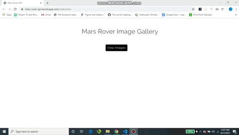

# Mars Rover API

This project uses NASAs open API, we use the API to get images that the curiosity rover has taken. Then we display the images, with each
is basic information about the image. 

[View the live demo](https://mars-rover-api.herokuapp.com/index.html)

To run this project on your PC follow the steps below.

1. Clone this repo to your PC using git clone.
2. Go to this projects directory location on your PC.
3. Open the directory, right click the HTML file and select "Open with"
4. Then select your preferred broswer.
5. The game should now be up and running on your PC in your preferred browser window.
